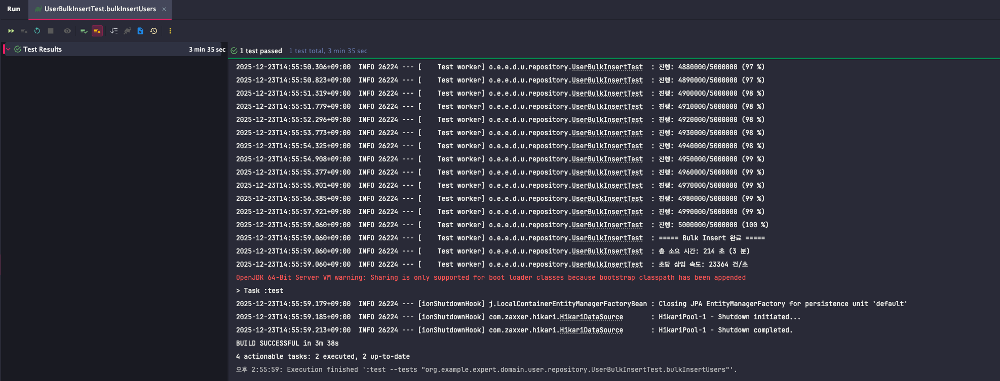
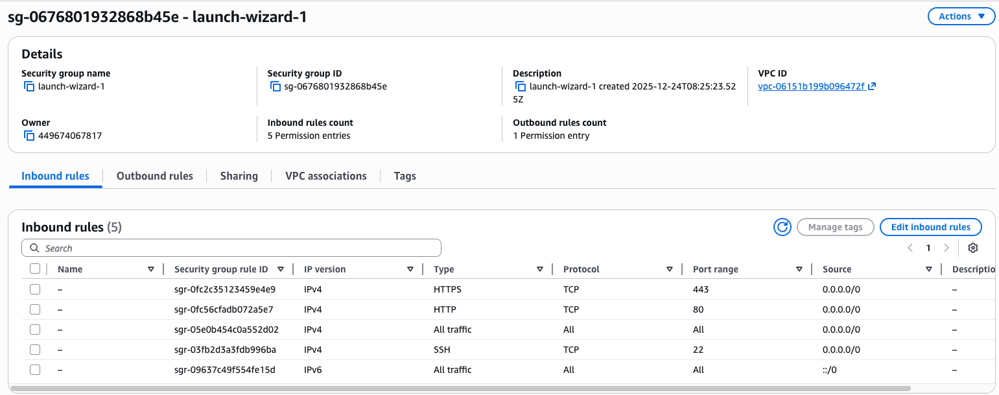
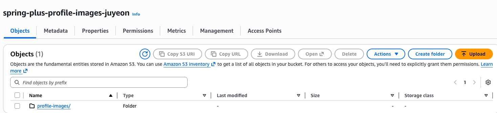
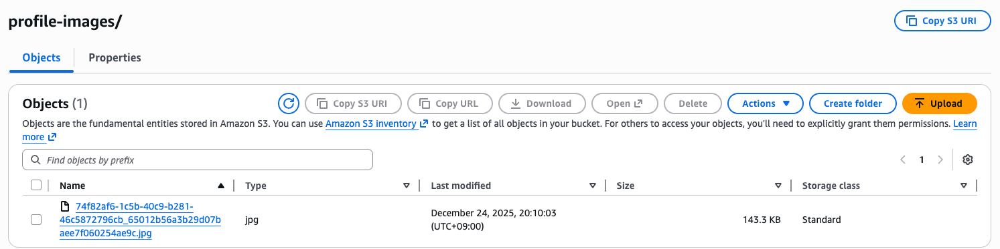
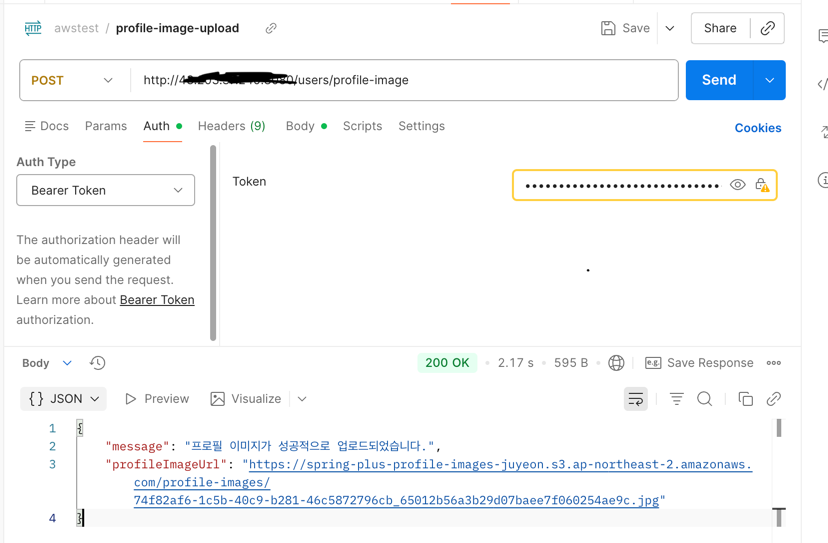

# SPRING PLUS

## Health Check API

서버 상태를 확인할 수 있는 Health Check API입니다.

- **Endpoint**: `GET /health`
- **인증**: 불필요 (누구나 접속 가능)
- **응답 예시**:
```json
{
  "status": "OK",
  "message": "Server is running",
  "timestamp": "2025-12-23T10:30:00"
}
```
---

## 대용량 데이터 처리

### 1. 개요

500만 건의 유저 데이터를 생성하고, 닉네임 검색 성능을 최적화하는 과제입니다.

### 2. JDBC Bulk Insert 구현

**위치**: `src/test/java/org/example/expert/domain/user/repository/UserBulkInsertTest.java`

#### 구현 방법

- **JDBC Batch Insert 사용**: PreparedStatement의 `addBatch()` 및 `executeBatch()` 활용
- **배치 크기**: 10,000건씩 처리
- **닉네임 중복 최소화**: UUID를 사용한 랜덤 닉네임 생성
  - 형식: `user_{UUID}_{순번}` (예: `user_a1b2c3d4_1000000`)

#### 실행 방법

1. `UserBulkInsertTest.java` 파일 열기
2. `@Disabled` 주석 처리
3. `bulkInsertUsers()` 테스트 실행

#### 성능 결과

| 항목 | 결과           |
|------|--------------|
| 총 데이터 수 | 5,000,000 건  |
| 배치 크기 | 10,000 건     |
| 소요 시간 | 214초 (3분35초) |
| 초당 삽입 속도 | 23364건       |


---

### 3. 닉네임 검색 API

**Endpoint**: `GET /users/search?nickname={닉네임}`

#### 요청 예시

```
GET /users/search?nickname=normal2_88b5cc7a_9504
```

#### 응답 예시

```json
[
  {
    "id": 1000000,
    "email": "user_1000000@test.com",
    "nickname": "normal2_88b5cc7a_9504"
  }
]
```

---

### 4. 성능 최적화 과정

#### 최적화 1: 인덱스 추가

**변경 내용**: `User` 엔티티에 `nickname` 컬럼 인덱스 추가

```java
@Table(name = "users", indexes = {
    @Index(name = "idx_nickname", columnList = "nickname")
})
```

**성능 측정 결과**:

| 측정 방법   | 인덱스 추가 전 | 인덱스 추가 후 | 개선율    |
|---------------------|----------|----------|--------|
| 테스트 코드    | 1500 ms  | 32 ms    | 97.87% |
| API 응답 (Postman)  | 959 ms   | 4 ms     | 99.58% |
---

### 5. 성능 테스트 실행 방법

**위치**: `src/test/java/org/example/expert/domain/user/service/UserSearchPerformanceTest.java`

1. 500만 건 데이터 생성 완료 확인
2. `UserSearchPerformanceTest.java` 파일 열기
3. `@Disabled` 주석 처리
4. 원하는 테스트 메서드 실행:
   - `testSearchPerformance()`: 기본 검색 성능 테스트
   - `testSearchNonExistentNickname()`: 존재하지 않는 닉네임 검색 (최악의 경우)
---

### 6. 주요 학습 내용

1. **JDBC Batch Insert의 중요성**
   - 일반 INSERT vs Batch INSERT의 성능 차이
   - 대량 데이터 처리 시 배치 단위 처리의 필요성

2. **인덱스의 효과**
   - Full Table Scan vs Index Scan
   - 검색 조건 컬럼에 인덱스 추가 시 성능 향상

3. **성능 측정의 중요성**
   - 최적화 전후 성능 비교
   - 로그를 통한 실행 시간 추적

---

## AWS 클라우드 배포

### 1. 배포 아키텍처

이 애플리케이션은 AWS 클라우드 인프라에 배포되었습니다.

#### 사용된 AWS 서비스

| 서비스 | 용도 | 스펙                                |
|--------|------|-----------------------------------|
| **EC2** | 애플리케이션 서버 | Ubuntu 22.04, t2.micro/t3.micro   |
| **RDS** | MySQL 데이터베이스 | MySQL 8.0                         |
| **S3** | 프로필 이미지 저장소 | spring-plus-profile-images-juyeon |
| **Elastic IP** | 고정 IP 주소 | 43.2xx.xx.xxx                     |

#### 아키텍처 다이어그램

```
[Client]
   ↓
[Elastic IP: 43.2xx.xx.xxx]
   ↓
[EC2 - Spring Boot Application]
   ↓                    ↓
[RDS - MySQL]     [S3 - Profile Images]
```

---

### 2. EC2 인스턴스 설정

#### 인스턴스 정보
- **AMI**: Ubuntu Server 22.04 LTS
- **인스턴스 타입**: t2.micro / t3.micro
- **스토리지**: 8GB
- **탄력적 IP**: 43.2xx.xx.xxx

#### 보안 그룹 설정

| 타입 | 프로토콜 | 포트 | 소스 | 용도 |
|------|----------|------|------|------|
| SSH | TCP | 22 | My IP | SSH 접속 |
| HTTP | TCP | 80 | 0.0.0.0/0 | HTTP 트래픽 |
| Custom TCP | TCP | 8080 | 0.0.0.0/0 | Spring Boot 애플리케이션 |

#### 스크린샷

<!-- EC2 인스턴스 목록 스크린샷 -->

<!-- EC2 보안 그룹 스크린샷 -->

---

### 3. RDS 데이터베이스 설정

#### 데이터베이스 정보
- **엔진**: MySQL 8.0
- **엔드포인트**: `database-1.chukcm80iauo.ap-northeast-2.rds.amazonaws.com:3306`
- **데이터베이스 이름**: expert

#### 보안 그룹 설정
- **MySQL/Aurora (3306)**: EC2 보안 그룹에서 접근 허용

#### 연결 설정
```properties
spring.datasource.url=jdbc:mysql://database-1.chukcm80iauo.ap-northeast-2.rds.amazonaws.com:3306/expert
spring.datasource.username=admin
spring.datasource.password=********
```

#### 스크린샷
<!-- RDS 데이터베이스 목록 스크린샷 -->


---

### 4. S3 버킷 설정

#### 버킷 정보
- **버킷 이름**: spring-plus-profile-images-juyeon
- **리전**: ap-northeast-2 (서울)
- **용도**: 사용자 프로필 이미지 저장

#### IAM 설정
- **사용자**: juyeonsung
- **권한**: AmazonS3FullAccess

#### 스크린샷
<!-- S3 버킷 목록 스크린샷 -->


---


### 5. S3 프로필 이미지 업로드 API

#### 프로필 이미지 업로드

**요청**:
```http
POST /users/profile-image
Authorization: Bearer {JWT_TOKEN}
Content-Type: multipart/form-data

Body:
  image: (image file)
```

**응답 예시**:
```json
{
  "profileImageUrl": "https://spring-plus-profile-images-juyeon.s3.ap-northeast-2.amazonaws.com/profile-images/uuid_filename.jpg",
  "message": "프로필 이미지가 성공적으로 업로드되었습니다."
}
```


#### 프로필 이미지 조회

**요청**:
```http
GET /users/profile-image
Authorization: Bearer {JWT_TOKEN}
```

**응답 예시**:
```json
{
  "profileImageUrl": "https://spring-plus-profile-images-juyeon.s3.ap-northeast-2.amazonaws.com/profile-images/uuid_filename.jpg"
}
```

---

### 6. Docker를 이용한 배포

#### Dockerfile
```dockerfile
FROM eclipse-temurin:21-jdk-jammy
COPY build/libs/*.jar app.jar
EXPOSE 8080
CMD ["java", "-jar", "-Dspring.profiles.active=aws", "app.jar"]
```

#### Docker 이미지
- **Docker Hub**: castlejuyeon/aws-test:1.0
- **플랫폼**: linux/amd64

#### 배포 명령어
```bash
# EC2에서 실행
sudo docker pull castlejuyeon/aws-test:1.0
sudo docker run -d -p 8080:8080 \
  -e SPRING_PROFILES_ACTIVE=aws \
  --name simple-aws \
  castlejuyeon/aws-test:1.0
```

---

### 7. 환경별 설정

#### 로컬 환경 (application.properties)
- **데이터베이스**: localhost:3306
- **용도**: 개발 및 500만 건 데이터 성능 테스트

#### AWS 환경 (application-aws.properties)
- **데이터베이스**: RDS 엔드포인트
- **S3**: 프로필 이미지 업로드
- **용도**: 프로덕션 배포 및 인프라 검증

---

### 8. 주요 학습 내용

1. **AWS 인프라 구성**
   - EC2, RDS, S3를 활용한 3-Tier 아키텍처 구축
   - 보안 그룹을 통한 네트워크 접근 제어
   - Elastic IP를 통한 고정 IP 할당

2. **Docker 컨테이너화**
   - Multi-platform 빌드 (ARM → AMD64)
   - 환경별 프로필 설정 (local, aws)
   - Docker Hub를 통한 이미지 배포

3. **S3 파일 업로드**
   - AWS SDK를 이용한 파일 업로드 구현
   - IAM 사용자 및 Access Key 관리
   - 업로드된 파일의 공개 URL 생성

4. **환경 분리**
   - 로컬 환경: 대용량 데이터 성능 테스트 (500만 건)
   - AWS 환경: 인프라 구성 검증 (최소 데이터셋)
   - Spring Profile을 통한 설정 분리